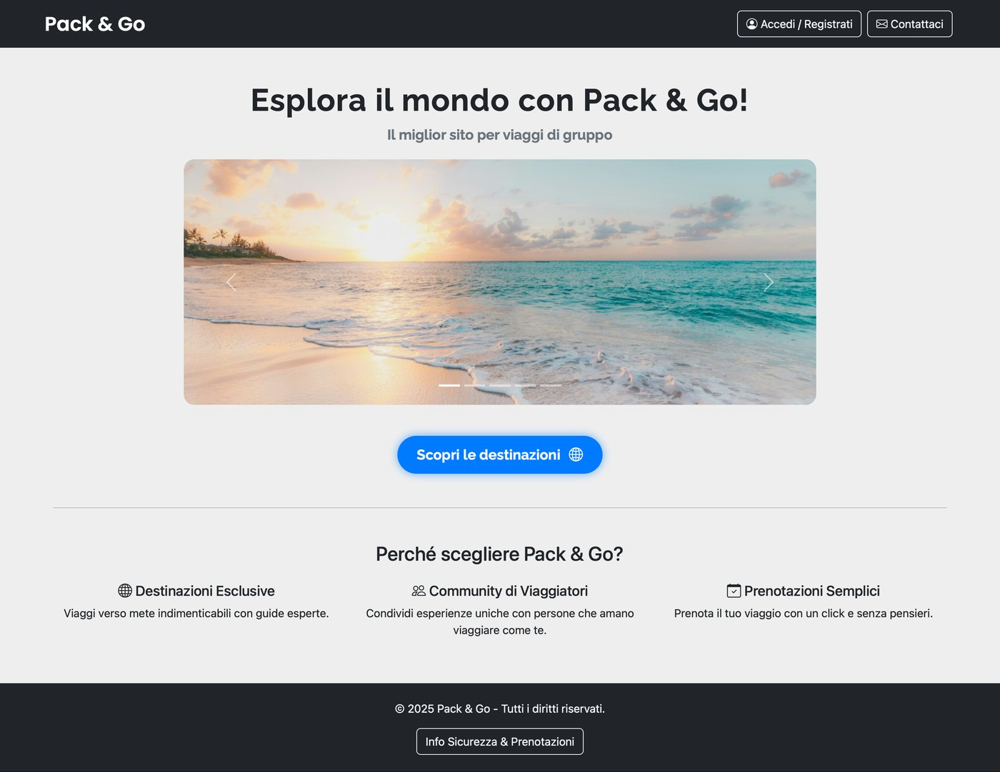
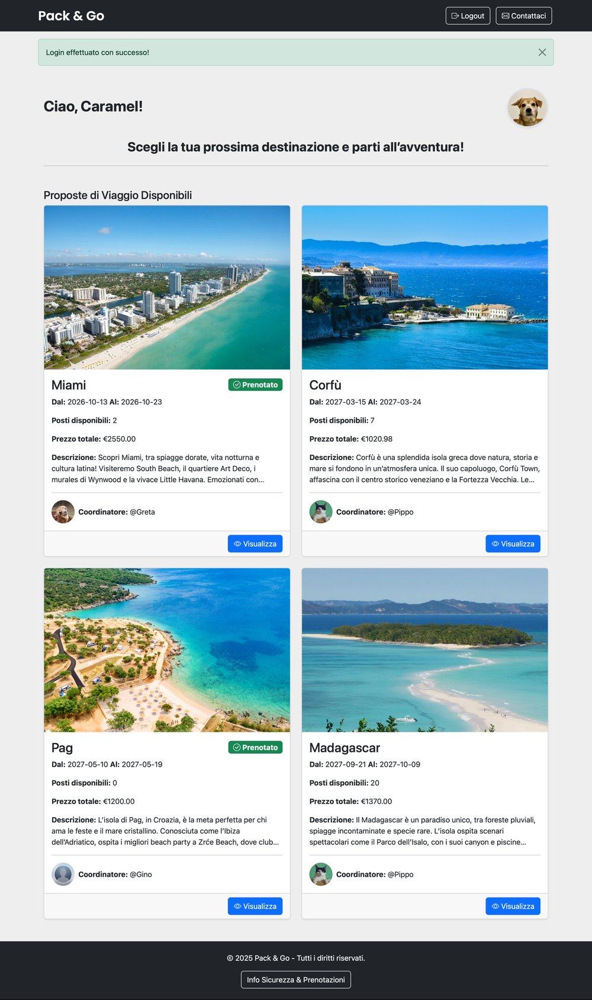
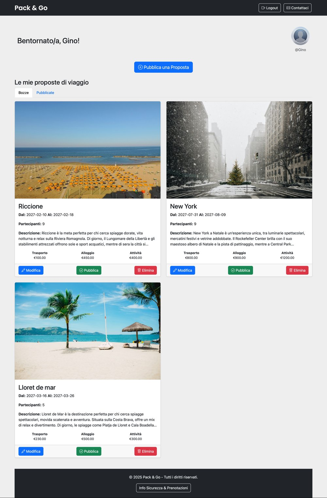
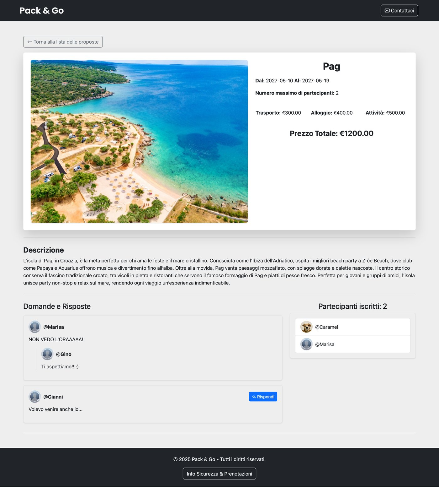

# Pack&Go

Pack&Go is a web application for organizing group trips. **Coordinators** create, edit and publish trip proposals and answer travelers' questions; **travelers** browse published trips, book a seat and ask questions.

It was my exam project for *Introduzione alle Applicazioni Web* (Introduction to Web Applications) at Politecnico di Torino, graded **30 e lode** (30/30 cum laude). After the exam I reviewed it from a security perspective and fixed the issues I found: the [original submission](https://github.com/Filippo-F/PackAndGo/tree/v1.0-exam) is kept under the `v1.0-exam` tag, and each fix is a separate commit ([see all changes](https://github.com/Filippo-F/PackAndGo/compare/v1.0-exam...main)).

Pack&Go is a fictional service: the contact details shown in the app are placeholders. The user interface and code comments are in Italian.

*Click any screenshot to open it at full size.*

[](docs/screenshots/home.jpg)

| [](docs/screenshots/traveler-dashboard.jpg) | [](docs/screenshots/coordinator-dashboard.jpg) |
|---|---|
| *Traveler dashboard: published upcoming trips* | *Coordinator dashboard: drafts* |

[](docs/screenshots/trip-details.jpg)
*Trip details: questions, answers and participants*

## Features

### Visitors
- Home page with a presentation of the service, contact and guarantee information
- Registration as traveler or coordinator, with an optional profile picture (automatically cropped and resized)
- Login

### Travelers
- Dashboard with all published upcoming trips, showing coordinator, dates, available seats and total price
- Trip detail page with description, budget breakdown, total price and questions and answers
- Booking, with checks on available seats, duplicate bookings and overlapping dates with other booked trips
- Questions to the coordinator on any published trip

### Coordinators
- New trip proposals, always created as drafts: destination, dates, maximum participants, description, transport/accommodation/activity budget and an image (resized to at most 1200×900)
- Edit or delete their own drafts
- Publish a draft (only if its start date is not in the past); published trips can no longer be modified
- List of participants for their own trips
- Answers to questions on their own trips

### All users
- When a form is rejected, its dialog reopens with the error message and the data already entered, so it can be corrected without starting over (passwords and files are never kept)

## Tech stack

| Layer | Technology |
|---|---|
| Backend | Python 3.10+, Flask 3.1, Flask-Login, Flask-WTF (CSRF protection) |
| Database | SQLite, accessed through a DAO layer (`*_dao.py`) with parameterized queries |
| Frontend | Jinja templates, Bootstrap 5, Bootstrap Icons, custom CSS |
| Images | Pillow |
| Original deployment | PythonAnywhere |

## Project structure

```
PackAndGo/
├── app.py                     # Flask app: configuration, routes, authentication, image handling
├── models.py                  # User class for Flask-Login
├── utenti_dao.py              # Users
├── proposte_viaggio_dao.py    # Trip proposals
├── prenotazioni_dao.py        # Bookings and booking rules
├── domande_risposte_dao.py    # Questions and answers
├── aggiorna_date_demo.py      # Shifts demo data dates so the demo stays usable over time
├── db/PackandGo.db            # SQLite database with demo data
├── templates/                 # Jinja templates (home, dashboards, trip details)
├── static/
│   ├── css/style.css
│   ├── img/                   # Site images
│   └── uploads/               # Profile pictures and trip images
├── docs/screenshots/          # Screenshots used in this README
├── utenti.txt                 # Demo users (original exam file)
├── CREDITS.md                 # Image credits
└── requirements.txt
```

## Getting started

Requires Python 3.10 or newer.

```bash
git clone https://github.com/Filippo-F/PackAndGo.git
cd PackAndGo
python3 -m venv venv
source venv/bin/activate          # Windows: venv\Scripts\activate
pip install -r requirements.txt
```

Optionally, move the demo data dates forward so that the demo trips are upcoming again:

```bash
python aggiorna_date_demo.py
```

Start the development server and open http://127.0.0.1:5001:

```bash
flask --app app run --debug --port 5001
```

### Secret key

Flask signs session cookies with a secret key, which is read from the `SECRET_KEY` environment variable. If it is not set, the app generates a temporary random key at every start, which is fine for a quick local test but logs you out whenever the server restarts. To keep sessions across restarts during development, set any value:

```bash
export SECRET_KEY=dev-local-key
```

In production, always set `SECRET_KEY` to a long random value, for example the output of `python -c "import secrets; print(secrets.token_hex(32))"`, and never commit it.

## Demo users

The password of each demo user is the same as the username.

| Username | Role | Demo scenario |
|---|---|---|
| `Pippo` | Coordinator | A published trip that has already started, published upcoming trips and a draft with the default image |
| `Greta` | Coordinator | One published trip |
| `Gino` | Coordinator | A trip with no seats left, three drafts and the default profile picture |
| `Caramel` | Traveler | Booked on two trips |
| `Marisa` | Traveler | Booked on the fully booked trip |
| `Gianni` | Traveler | No bookings |

## Security notes

### Protections in the original project
- **Password hashing**: passwords are stored as salted scrypt hashes (Werkzeug `generate_password_hash`), never in plain text.
- **SQL injection**: every query uses parameters (`?` placeholders) instead of string concatenation.
- **XSS**: all user content is rendered through Jinja autoescaping; no template uses `|safe`.
- **File uploads**: extension allow-list, re-encoding of every image through Pillow, and file names generated by the server instead of taken from the uploaded file.
- **Authorization on changes**: editing, deleting and publishing a proposal check that the logged-in coordinator owns it and that it is still a draft; protected routes require login.

### Issues found and fixed after the exam

| Issue | Impact | Fix |
|---|---|---|
| Hardcoded Flask secret key | Anyone reading the source could forge a session cookie and log in as any user, without a password | Key read from `SECRET_KEY` ([dfdb99e](https://github.com/Filippo-F/PackAndGo/commit/dfdb99e)) |
| No CSRF protection | An external site could make a logged-in user book, publish or delete trips | Flask-WTF `CSRFProtect` on every POST form ([51bbc3f](https://github.com/Filippo-F/PackAndGo/commit/51bbc3f)) |
| Drafts and participants visible to anyone (IDOR on `/proposta/<id>`) | Any logged-in user could read other coordinators' drafts and participant lists by changing the ID in the URL | Drafts visible only to their owner, participants only to the owning coordinator ([86140b8](https://github.com/Filippo-F/PackAndGo/commit/86140b8)) |
| Missing ownership check on answers | A coordinator could answer questions on other coordinators' trips, blocking the real answer | Ownership checked, proposal ID read from the database instead of a hidden form field ([86140b8](https://github.com/Filippo-F/PackAndGo/commit/86140b8)) |
| Bookings and questions on drafts or past trips | Unpublished drafts could be booked and past trips were still bookable | Only published upcoming trips accept bookings; questions only on published trips ([f686444](https://github.com/Filippo-F/PackAndGo/commit/f686444)) |
| Profile pictures named after the username | A new user could overwrite another user's picture, or the default avatar shown for everyone | Random server-generated file names ([ed3c392](https://github.com/Filippo-F/PackAndGo/commit/ed3c392)) |
| No limits on uploads | Large files and decompression bombs (a 47 KB PNG that decodes to 400 megapixels) could exhaust server memory or cause errors | 10 MB request limit, 50 megapixel image limit, invalid images rejected with a message ([ed3c392](https://github.com/Filippo-F/PackAndGo/commit/ed3c392)) |
| Form limits enforced only in the browser | Accounts with empty passwords, empty usernames or invalid user types could be created with a crafted request | Required fields, lengths and user type validated on the server ([d1f21d3](https://github.com/Filippo-F/PackAndGo/commit/d1f21d3)) |
| Unpinned, outdated dependencies | `requirements.txt` listed no versions, and the versions in use had known vulnerabilities in Pillow, Werkzeug, Flask and Jinja2 | Pinned versions with no known vulnerabilities in the OSV database ([d1f21d3](https://github.com/Filippo-F/PackAndGo/commit/d1f21d3)) |
| Logout through GET | Any page could log users out with a simple link or image | Logout requires POST with a CSRF token ([a1d11fa](https://github.com/Filippo-F/PackAndGo/commit/a1d11fa)) |

Other fixes: error messages no longer expose raw database exceptions, invalid budgets and missing fields no longer cause 500 errors, invalid proposal edits no longer leave orphan image files, and three unused routes that always failed were removed ([a504f61](https://github.com/Filippo-F/PackAndGo/commit/a504f61)).

### Possible next steps
The project is designed as a demo, so some measures typical of production services were left for future work:
- rate limiting on login attempts;
- security headers such as Content-Security-Policy, and Subresource Integrity for the Bootstrap files loaded from a CDN;
- case-insensitive usernames;
- a database such as PostgreSQL for higher concurrent traffic.

## Credits

Photos are from [Unsplash](https://unsplash.com); see [CREDITS.md](CREDITS.md) for authors and links.

## Author

**Filippo Ferrari** · [LinkedIn](https://www.linkedin.com/in/filippo-ferrari-9135933b4/)

## License

All rights reserved. The code is published to showcase my work; no license is granted to reuse or redistribute it.
